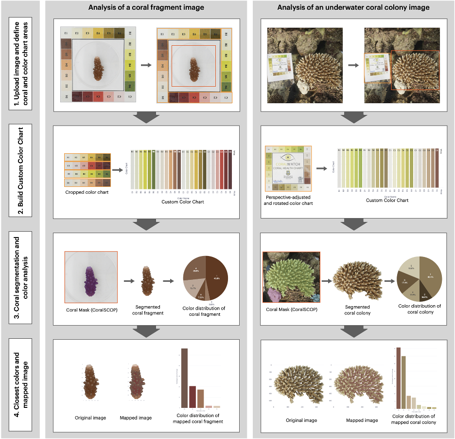

# Coral-CAT-Coral-Color-Assessment-Tool
The repository contains the scripts an notebook to use AI tools for color assessment using a color chart on coral images  



## Abstract
Coral health status assessments based on pigmentation/color rely mostly on the comparison of the coral color with well-established color references, such as the Coral Watch Coral Health Charts (University of Queensland (Siebeck et al. 2006)). In most cases, the assignment of color codes is done manually in a time-consuming and non-standardized way. Here, we present a newly developed semi-automatic image analysis tool to assign color codes to coral images. The pipeline allows the standardized and automatic extraction of the color (RGB) of each pixel of a cropped coral image and assigns the closest color code, which is extracted from the color chart included in the same picture. This feature reduces the bias due to different image lightening. Then, the percentage of pixels corresponding to each color code is assessed. We validated the tool against human visual assessments using a real case study where we assessed the color score of 68 images of coral fragments. Finally, we successfully assessed the color codes of underwater images of coral colonies. This tool provides an easy and objective method for the color assessment of coral images, allowing the monitoring of coral bleaching status and color changes.


## Getting Started

### Hardware Specifications used:
- **CPU**: Intel(R) Xeon(R) Gold 6150 CPU @ 2.70GHz, 72 cores, 2 threads, 1200.049 MHz base clock, 3700.0000 MHz boost clock
- **GPU**: Quadro GV100, 32505 MiB, 32508 MiB
- **RAM**: 187G
- **Storage**: sda: 447.1G, sdb: 1.8T, sdc: 5.5T

### Minimum Hardware Specifications:
- **CPU**: Quad-core processor (e.g., Intel Core i5 or AMD Ryzen 5)
- **GPU**: NVIDIA GPU with at least 4 GB VRAM (e.g., NVIDIA GTX 1050 Ti)
- **RAM**: 16 GB DDR4
- **Storage**: 256 GB SSD

### Software Specifications:
- **Operating System**: Ubuntu 18.04 LTS
- **Conda version**:  23.9.0 or higher


### Installation

**1. Prepare the codes and the environment**

Install miniconda or miniforge, the create a python virtual environment and activate it via the following commands:

```bash
conda env create -f coral.yaml -p $PWD/env
conda activate $PWD/env
```

**2. Download the pre-trained weights for CoralSCOP**

We use the trained [CoralSCOP model](https://www.dropbox.com/scl/fi/pw5jiq9oc8e8kvkx1fdk0/vit_b_coralscop.pth?rlkey=qczdohnzxwgwoadpzeht0lim2&st=actcedwy&dl=0) (ViT-B backbone). Download the weights and save them in the `checkpoints` folder.

**3. Run the Coral CAT streamlit app**

To run the streamlit app, run the following command:

```bash
cd app
streamlit run streamlit_starting_page.py
```

The app will be available at `http://localhost:8501/` . To share with another user user the **Network URL** but please use with **caution**.

**4. Run the notebooks for Color CAT**

On the `notebooks` folder, you will find the example notebooks used as quick prototypes of the **Coral CAT app**. You can run them using Jupyter Notebook or Jupyter Lab. Use the provided conda environment to run the notebooks.


## Project Organization
------------

    ├── LICENSE
    │
    ├── README.md           <- The top-level README for developers using this project.
    │
    ├── data                <- A folder for the expected csv files for input and destinations for output 
    │    └── raw            <- CSV files from the HPO for the models
    │         └── fragments   <- Image files of coral fragments
    │         └── underwater  <- Image files of underwater coral colonies
    │    └── interim        <- Pre-processed images for coral fragments on a light chamber
    │         └── up        <- Pre-processed image files of up part of the color chart
    │         └── down      <- Pre-processed image files of down part of the color chart   
    │         └── left      <- Pre-processed image files of left part of the color chart
    │         └── rigth     <- Pre-processed image files of rigth part of the color chart
    │         └── center_fragmet    <- Pre-processed image files coral fragments
    │    └── final          <- Folder for the final results of the color assessment
    │
    ├── app                 <- Main folder for the web based Coral CAT app 
    │    └── pages          <- Contains each of the program that will be used in the app as modules
    │    └── images         <- Folder for the images and logos used in the app
    │    └── load_functions.py          <- Master function library for the app
    │    └── streamlit_starting_page.py <- Main file to run the Coral CAT app
    │    └── Dockerfile     <- Dockerfile for the app
    │
    ├── checkpoints         <- folder for the CoralSCOP model weights
    │
    ├── notebooks           <- Example Jupyter notebooks from the Coral CAT project
    │
    ├── environment.yml     <- The requirements file for reproducing the analysis environment, e.g.
    │                         generated with `conda env export --no-builds | head -n -1 > environment.yml`

    

--------

## License

This project is licensed under the MIT License - see the LICENSE file for details.